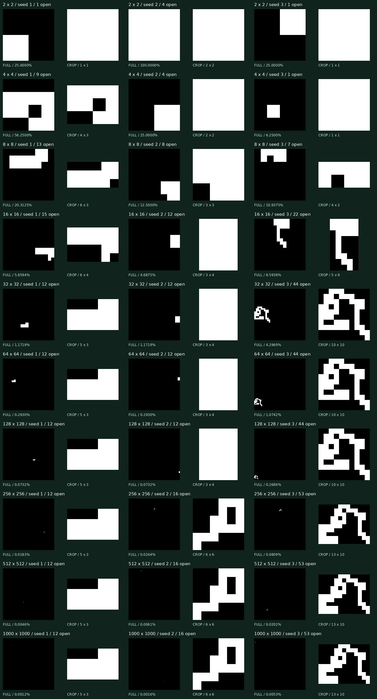

# Backward-growth collection v1

30 unselected runs: three 512-bit seeds at ten square sizes, 2 through 1000. Generator: `backward-growth-v1`; sampler: `uniform-legal-cell-v1`. Every board and recipe is validated against Mortal Coil physics.

**24 of 30 runs trapped before their selected target size.** Completeness guarantees that every valid construction is possible; it does not make large, dense boards likely. The table distinguishes board dimensions from occupied extent. Large black previews are not missing images: walls are black and open cells are white.

| Side | Sample | Open cells | Board coverage | Occupied bounds | Slides | Stop |
|---:|---:|---:|---:|---|---:|---|
| 2 | [1](2-backward-v1-s1/detail.png) | 1 | 25.0000% | 1 x 1 | 0 | target-reached |
| 2 | [2](2-backward-v1-s2/detail.png) | 4 | 100.0000% | 2 x 2 | 3 | target-reached |
| 2 | [3](2-backward-v1-s3/detail.png) | 1 | 25.0000% | 1 x 1 | 0 | target-reached |
| 4 | [1](4-backward-v1-s1/detail.png) | 9 | 56.2500% | 4 x 3 | 5 | target-reached |
| 4 | [2](4-backward-v1-s2/detail.png) | 4 | 25.0000% | 2 x 2 | 3 | target-reached |
| 4 | [3](4-backward-v1-s3/detail.png) | 1 | 6.2500% | 1 x 1 | 0 | target-reached |
| 8 | [1](8-backward-v1-s1/detail.png) | 13 | 20.3125% | 6 x 3 | 6 | trapped |
| 8 | [2](8-backward-v1-s2/detail.png) | 8 | 12.5000% | 3 x 3 | 5 | trapped |
| 8 | [3](8-backward-v1-s3/detail.png) | 7 | 10.9375% | 4 x 2 | 5 | trapped |
| 16 | [1](16-backward-v1-s1/detail.png) | 15 | 5.8594% | 6 x 4 | 6 | trapped |
| 16 | [2](16-backward-v1-s2/detail.png) | 12 | 4.6875% | 3 x 4 | 6 | trapped |
| 16 | [3](16-backward-v1-s3/detail.png) | 22 | 8.5938% | 5 x 9 | 13 | trapped |
| 32 | [1](32-backward-v1-s1/detail.png) | 12 | 1.1719% | 5 x 3 | 6 | trapped |
| 32 | [2](32-backward-v1-s2/detail.png) | 12 | 1.1719% | 3 x 4 | 6 | trapped |
| 32 | [3](32-backward-v1-s3/detail.png) | 44 | 4.2969% | 10 x 10 | 28 | trapped |
| 64 | [1](64-backward-v1-s1/detail.png) | 12 | 0.2930% | 5 x 3 | 6 | trapped |
| 64 | [2](64-backward-v1-s2/detail.png) | 12 | 0.2930% | 3 x 4 | 6 | trapped |
| 64 | [3](64-backward-v1-s3/detail.png) | 44 | 1.0742% | 10 x 10 | 28 | trapped |
| 128 | [1](128-backward-v1-s1/detail.png) | 12 | 0.0732% | 5 x 3 | 6 | trapped |
| 128 | [2](128-backward-v1-s2/detail.png) | 12 | 0.0732% | 3 x 4 | 6 | trapped |
| 128 | [3](128-backward-v1-s3/detail.png) | 44 | 0.2686% | 10 x 10 | 28 | trapped |
| 256 | [1](256-backward-v1-s1/detail.png) | 12 | 0.0183% | 5 x 3 | 6 | trapped |
| 256 | [2](256-backward-v1-s2/detail.png) | 16 | 0.0244% | 6 x 6 | 8 | trapped |
| 256 | [3](256-backward-v1-s3/detail.png) | 53 | 0.0809% | 13 x 10 | 30 | trapped |
| 512 | [1](512-backward-v1-s1/detail.png) | 12 | 0.0046% | 5 x 3 | 6 | trapped |
| 512 | [2](512-backward-v1-s2/detail.png) | 16 | 0.0061% | 6 x 6 | 8 | trapped |
| 512 | [3](512-backward-v1-s3/detail.png) | 53 | 0.0202% | 13 x 10 | 30 | trapped |
| 1000 | [1](1000-backward-v1-s1/detail.png) | 12 | 0.0012% | 5 x 3 | 6 | trapped |
| 1000 | [2](1000-backward-v1-s2/detail.png) | 16 | 0.0016% | 6 x 6 | 8 | trapped |
| 1000 | [3](1000-backward-v1-s3/detail.png) | 53 | 0.0053% | 13 x 10 | 30 | trapped |

## Assets for gallery integration

`manifest.json` has one entry per board with relative asset links and generator labels. `summary.csv` contains the same flat records. Per-board `stats.json` embeds the existing `BoardCharacterization` geometry schema, plus target size, stopping reason, occupied bounds, solution slide count, endpoint coordinates, seed, random-stream version, and validation.

`map.png` is the full board, exactly one pixel per cell. `preview.png` is a 480-square whole-board overview. `detail.png` is a visibly labeled crop around the occupied region; do not display it as a full board. `solution-map.png` and `solution-detail.png` color forward visitation order from blue start to orange finish. `recipe.json` records every prepend. The gzip board and solution use the existing interchange format.

Do not silently mix this unfiltered generator with the earlier wander/tweak generator or apply density/quality filtering to this completeness survey. No runs were discarded or retried.

## Reproduce and verify

Build Release, then run `python3 scripts/build_backward_collection.py NEW-DIRECTORY --plan gallery/backward-v1/plan.json`. The script requires Pillow. Run `dotnet run -c Release -- verify-collection gallery/backward-v1` to check saved maps, hashes, geometry, and physics. Replay any recipe with `gen-backward --recipe FILE --out NEW-STEM`. Generation times may differ; board hashes and recipes are reproducible.

Every saved specimen also has a `construction.code.json`, linked by the manifest. These variable-length numeric codes reconstruct the exact board and solution with `gen-any --code-file FILE --out NEW-STEM`. All 30 codes were encoded and replayed through both validators. [Universal construction and terminology](../../UNIVERSAL-GENERATOR.md).
