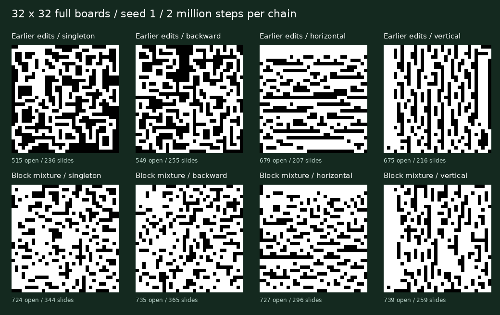
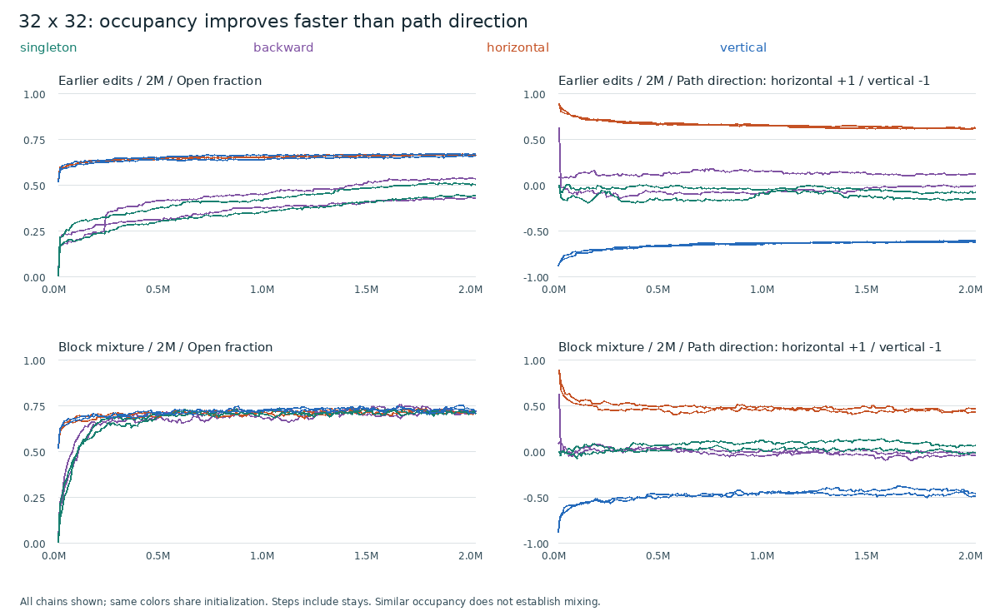
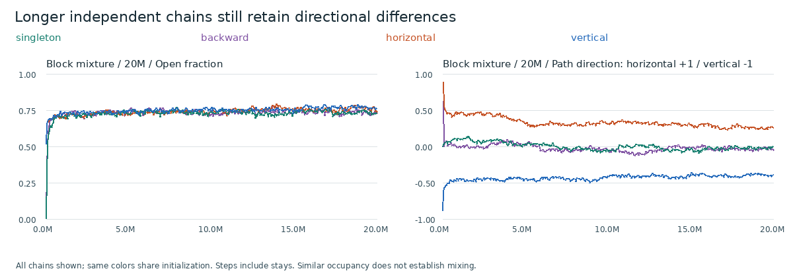
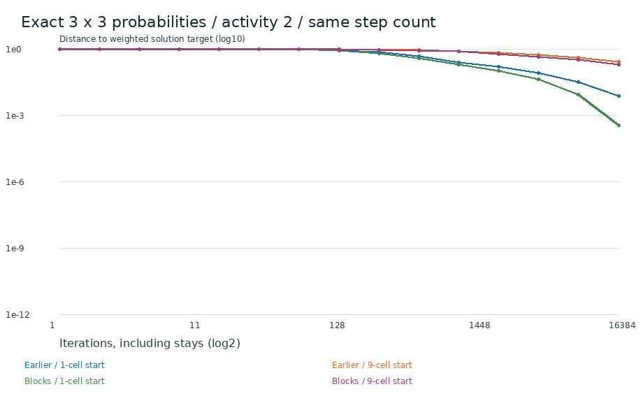
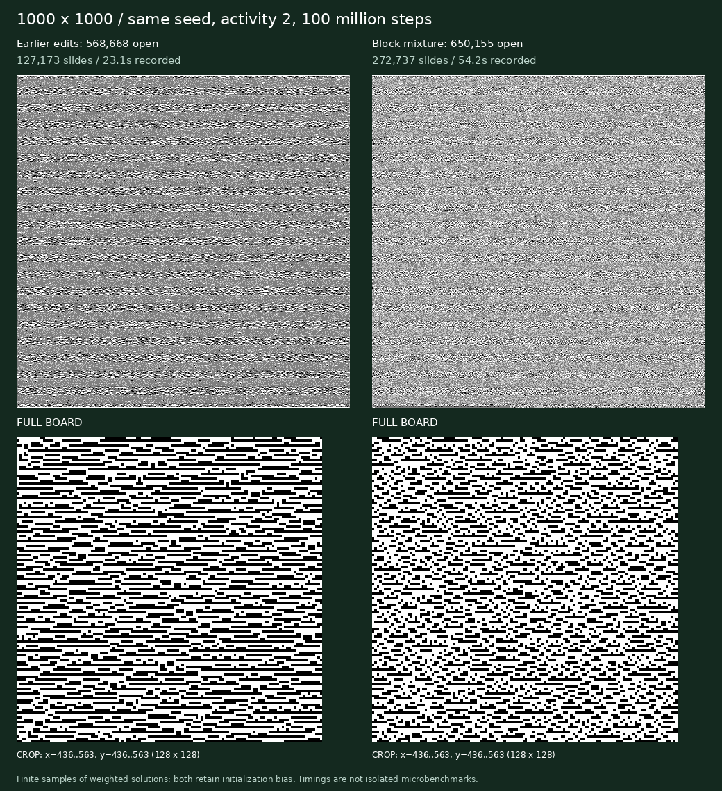

# Deeper sampling experiments v1

[Research, method, guarantees, and interpretation](../../DEEP-SAMPLING.md). This collection retains all 46 path specimens, plus 48 uniform 5x5 boards, 48 uniform 6x6 boards, and six uniform 7x7 boards from a run that reached its attempt limit. All saved path specimens have images, geometry, solutions, and construction codes.

| Kernel | Steps per chain | Chains | Final open cells | Occupancy R-hat | Path-direction R-hat |
|---|---:|---:|---:|---:|---:|
| legacy | 2,000,000 | 8 | 440–686 | 3.805 | 4.111 |
| deep | 2,000,000 | 8 | 724–739 | 1.445 | 3.849 |
| legacy | 4,000,000 | 8 | 546–691 | 3.373 | 4.186 |
| deep | 20,000,000 | 4 | 747–784 | 1.488 | 2.766 |

All these R-hat values flag remaining disagreement. They use the last half of each trace, then rank normalization, splitting, and folding. A value near 1 alone would not prove mixing. [Diagnostics and bulk ESS](diagnostics.json). The 4M legacy run is an approximate runtime comparison; recorded mean runtimes are in diagnostics.json.

[Uniform 5x5 boards](uniform-5x5/boards.png), [uniform 6x6 boards](uniform-6x6/boards.png), [partial uniform 7x7 collection](uniform-7x7/boards.png). [Uniform run statistics](uniform-summary.json).

[Path specimen manifest](manifest.json). The initial `controls/` pilot reused the same two base streams across starts and is retained separately; the reported diagnostics use `independent-controls/`, `effort-controls/`, and `long-controls/`, with distinct streams per start. Nothing was selected or rerun to replace a less favorable result. Reproduction plans record every parameter and stream derivation.

`python3 scripts/build_deep_collection.py NEW-DIRECTORY --plan gallery/deep-v1/plan.json` reproduces the main comparison. `long-plan.json` and `effort-plan.json` select the other experiments. `python3 scripts/report_deep_sampling.py` rebuilds this report.
