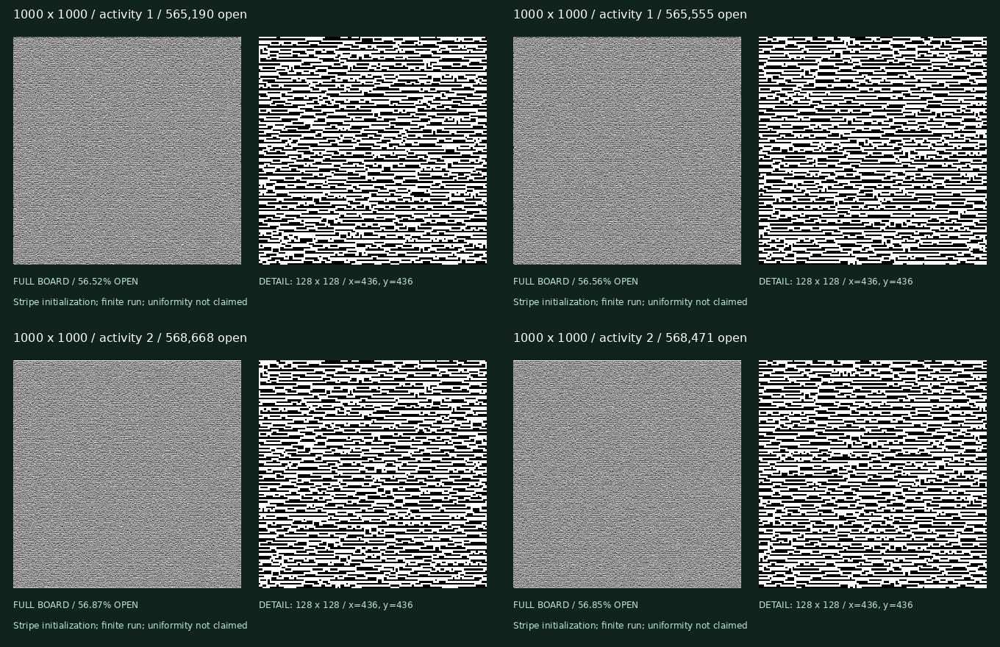

# Solution-edit collection v1

The saved identifier `reversible-path-v1` means undoable generator edits. Solutions need not be playable backward. Each specimen now includes a validated `construction.code.json` usable with `gen-any --code-file FILE --out NEW-STEM`; the manifest links these codes. [Coverage proof and terminology](../../UNIVERSAL-GENERATOR.md).

20 specimens: 16, 64, 256, 512, and 1000 square; two saved 512-bit seeds; activities 1 and 2. Every main run starts from a validated serpentine corridor board and performs 100 iterations per board cell. Two additional 64-square controls use the same seed and five million steps from different starts. All planned runs are retained. All 22 specimens were fully regenerated from their seeds; boards, solutions, recipes, geometry, acceptance counts, and occupancy histories matched exactly (see `seed-verification.json`).

**These are finite runs targeting weighted ordered solutions, not uniform board samples.** Activity 1 gives equal stationary weight to solutions; activity 2 gives each solution weight 2^openCells. A board's weight also includes its number of solutions. Initialization dependence and remaining stripes are visible; equilibrium on large boards is not established.

| Board | Activity | Open cells | Coverage | Slides |
|---|---:|---:|---:|---:|
| [16-reversible-a1-s1](16-reversible-a1-s1/detail.png) | 1 | 151 | 58.98% | 43 |
| [16-reversible-a1-s2](16-reversible-a1-s2/detail.png) | 1 | 151 | 58.98% | 41 |
| [16-reversible-a2-s1](16-reversible-a2-s1/detail.png) | 2 | 167 | 65.23% | 35 |
| [16-reversible-a2-s2](16-reversible-a2-s2/detail.png) | 2 | 169 | 66.02% | 41 |
| [64-reversible-a1-s1](64-reversible-a1-s1/detail.png) | 1 | 2,302 | 56.20% | 561 |
| [64-reversible-a1-s2](64-reversible-a1-s2/detail.png) | 1 | 2,280 | 55.66% | 545 |
| [64-reversible-a2-s1](64-reversible-a2-s1/detail.png) | 2 | 2,432 | 59.38% | 513 |
| [64-reversible-a2-s2](64-reversible-a2-s2/detail.png) | 2 | 2,426 | 59.23% | 514 |
| [256-reversible-a1-s1](256-reversible-a1-s1/center-detail.png) | 1 | 36,937 | 56.36% | 8,415 |
| [256-reversible-a1-s2](256-reversible-a1-s2/center-detail.png) | 1 | 36,902 | 56.31% | 8,383 |
| [256-reversible-a2-s1](256-reversible-a2-s1/center-detail.png) | 2 | 37,660 | 57.46% | 8,399 |
| [256-reversible-a2-s2](256-reversible-a2-s2/center-detail.png) | 2 | 37,597 | 57.37% | 8,279 |
| [512-reversible-a1-s1](512-reversible-a1-s1/center-detail.png) | 1 | 147,843 | 56.40% | 33,009 |
| [512-reversible-a1-s2](512-reversible-a1-s2/center-detail.png) | 1 | 147,847 | 56.40% | 32,892 |
| [512-reversible-a2-s1](512-reversible-a2-s1/center-detail.png) | 2 | 148,966 | 56.83% | 32,873 |
| [512-reversible-a2-s2](512-reversible-a2-s2/center-detail.png) | 2 | 149,327 | 56.96% | 32,865 |
| [1000-reversible-a1-s1](1000-reversible-a1-s1/center-detail.png) | 1 | 565,190 | 56.52% | 126,172 |
| [1000-reversible-a1-s2](1000-reversible-a1-s2/center-detail.png) | 1 | 565,555 | 56.56% | 126,963 |
| [1000-reversible-a2-s1](1000-reversible-a2-s1/center-detail.png) | 2 | 568,668 | 56.87% | 127,173 |
| [1000-reversible-a2-s2](1000-reversible-a2-s2/center-detail.png) | 2 | 568,471 | 56.85% | 127,013 |
| [controls/64-singleton-a2-s1](controls/64-singleton-a2-s1/detail.png) | 2 | 398 | 9.72% | 177 |
| [controls/64-stripes-a2-s1](controls/64-stripes-a2-s1/detail.png) | 2 | 2,594 | 63.33% | 799 |

[Sampling study and measured bias](../sampling-v1/README.md). [Machine-readable manifest](manifest.json) and [CSV](summary.csv). Each folder includes validated gzip board/solution, final construction recipe, full map, solution colors, and exact geometry. Larger specimens also include visibly labeled 128-square center details. `stats.json` records proposals, accepted operations, occupancy history, initialization, activity, seed, and the stationary target.

Reproduce: build Release and run `python3 scripts/build_reversible_collection.py NEW-DIRECTORY --plan gallery/reversible-v1/plan.json`. Verify with `verify-collection gallery/reversible-v1`. Final recipes replay with `gen-backward --recipe FILE --out NEW-STEM`. Gallery integration should preserve the generator, target distribution, and initialization labels.
