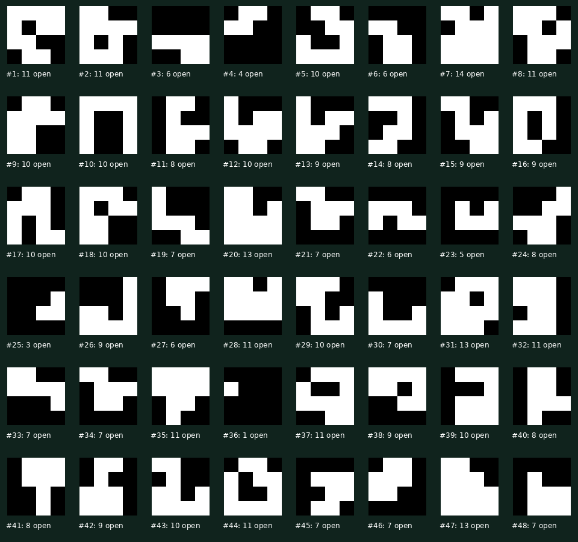
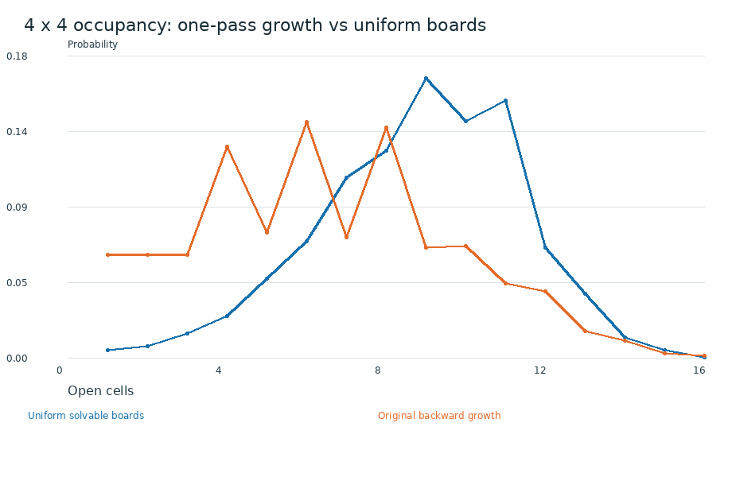
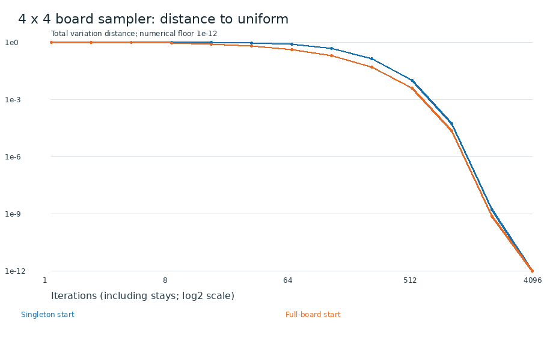
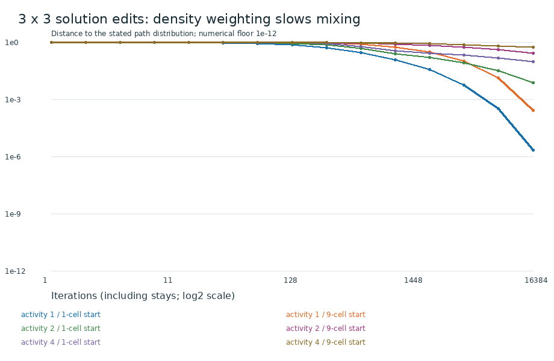
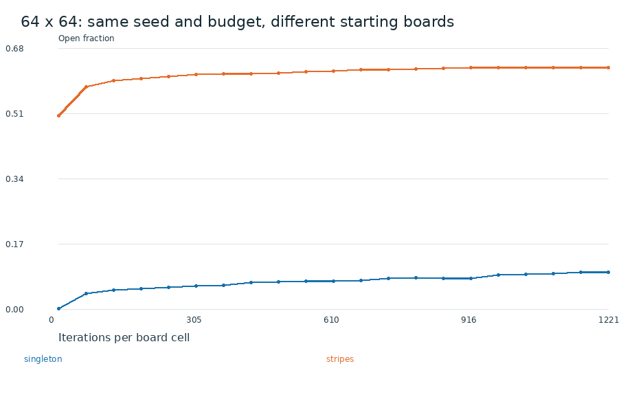

# Sampling study v1

The exact sampler, the board-state Markov chain, and the scalable path sampler are implemented. Their output distributions are different and are labeled separately.

## Exact uniform board sampling

`sample-uniform 4 NEW-DIRECTORY --count 48` enumerates all 3,503 solvable boards, assigns one index per board, and draws indices uniformly. Solution multiplicity does not affect selection. The saved 48 draws include repeats when drawn; there is no uniqueness filter. Every witness also passes backward structural validation and independent Mortal Coil replay.

Uniform 4x4 mean occupancy: **8.85527**. Original backward sampler: **6.44705**. Occupancy is calculated from complete distributions, not these 48 draws.

## Uniform board-state chain

The lazy random-cell-flip chain is implemented with exact catalogue membership. Every accepted transition and its reverse have equal probability; rejected and lazy steps remain in the clock. Transition probabilities were propagated from singleton and full-board starts on 2x2, 3x3, and 4x4. On 4x4, both approach uniformity to floating-point precision by 4,096 steps. This is a small-board result, not a bound for 1000-square boards. `sample-uniform 4 NEW-DIRECTORY --method chain --burn-in 4096 --stride 128` also exports actual chain draws; 48 are saved in `chain-4x4/` with their seed and labels. They remain correlated samples.

## Undoable solution-edit chain

All 477 ordered 3x3 solutions and all production proposal descriptors were enumerated. Detailed-balance residual was zero at double precision for activities 1, 2, and 4. The target is activity^openCells per solution, or solutionCount * activity^openCells per board.

| Activity | Stationary mean open cells (3x3) | TV distance after 16,384 steps: singleton / full start |
|---:|---:|---:|
| 1 | 5.37736 | 0.000002 / 0.000256 |
| 2 | 7.31642 | 0.007222 / 0.268689 |
| 4 | 8.21130 | 0.096994 / 0.542153 |

Stronger occupancy weighting slows exploration. Matching an occupancy average does not establish that the whole distribution has converged.

## Large boards and initialization

[22 saved solution-edit specimens through 1000 square](../reversible-v1/README.md). The four 1000-square runs contain 565,190, 565,555, 568,668, 568,471 open cells. These large occupied puzzles start from large valid corridor boards; they were not grown from singleton seeds to those sizes during this run.

At 64x64, the controlled five-million-step runs end at 398 cells from singleton, 2,594 cells from stripes. This demonstrates remaining initialization bias. The large samples must not be advertised as uniform or equilibrated.

## Reproduce

Build Release. `sampling-study NEW.json` writes board-distribution and `.paths.json` studies. `sample-uniform 4 NEW-DIRECTORY --count 48 --seed-hex HEX` replays exact draws using the seed in `uniform-4x4/sampling.json`. `python3 scripts/report_sampling.py` rebuilds the manifests and PNG figures from saved JSON and maps using Pillow. Floating-point propagation has rounding error but no Monte Carlo error.
